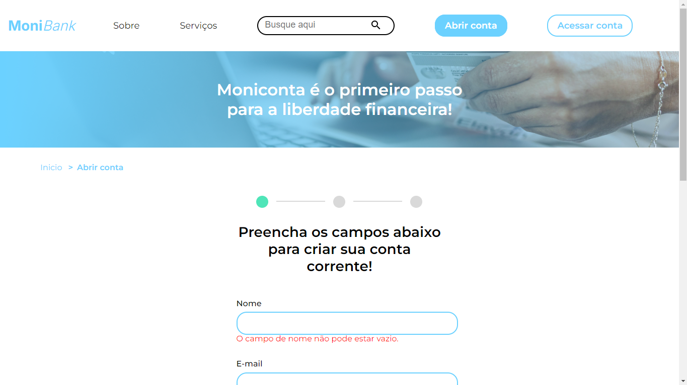

  

<h3>Imagem do projeto</h3>

  

  

Formulário de criação de contas para o banco virtual MoniBank.

## Tecnologias utilizadas durante o curso
* JavaScript

## Tecnologias utilizadas no projeto
* HTML
* CSS
